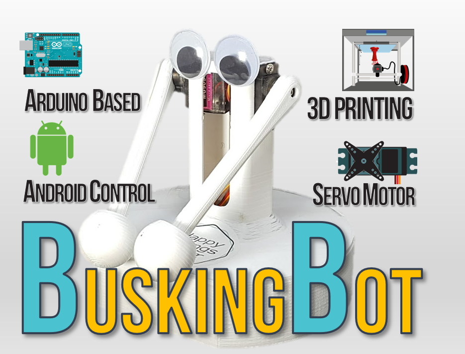
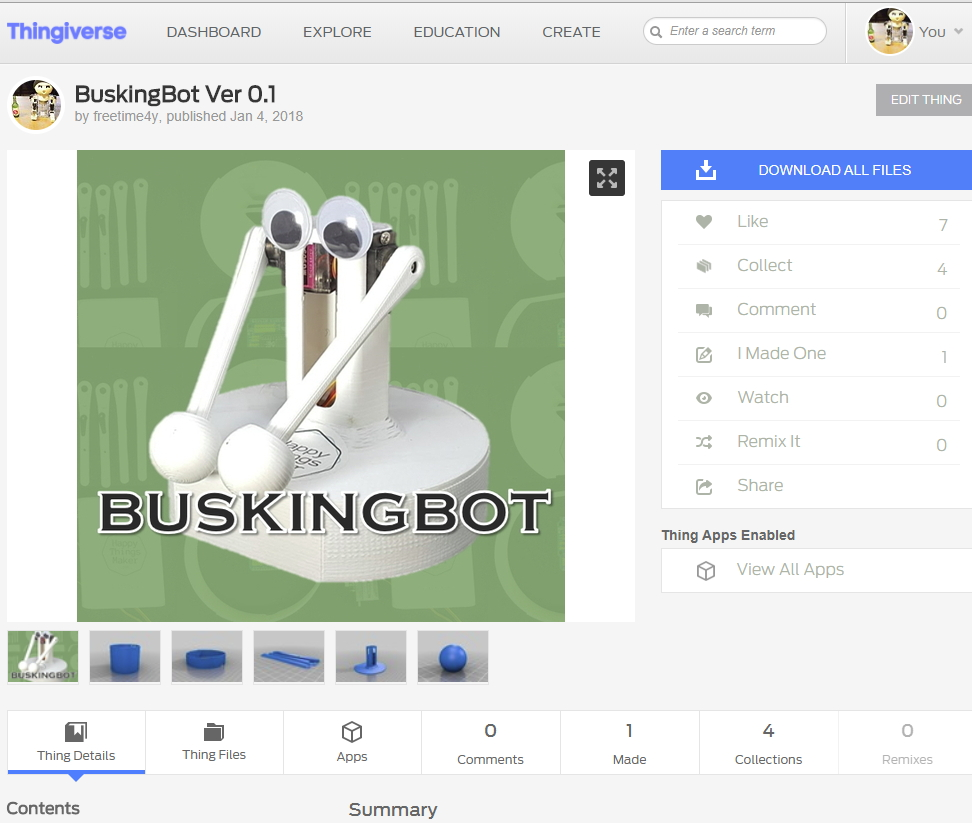

# Open BuskingBot - Arduino drum player robot

- Youtube Demo
    - https://youtu.be/ZQszbdXlZFM?list=PLXEhuWdUlcWBM9V6OUaw-OV34vn0xmkCZ
- Youtube instruction
    - https://youtu.be/0rcoJJfILkA?list=PLXEhuWdUlcWBM9V6OUaw-OV34vn0xmkCZ
- Instructables
    - https://www.instructables.com/id/BuskingBot-Arduino-Drum-Player-Robot/

## Materials
- https://eunchan.me/BUSKINGBOT-d081a51e90bc4085ab07753aee4c1f09
------------------------------------ Instruction --------------------------

- Source Code
    - https://github.com/happythingsmaker/openBuskingBot
- 3D model file (for 3d printer)
    - https://www.thingiverse.com/thing:2742894
- Youtube
    - https://www.youtube.com/playlist?list=PLXEhuWdUlcWBM9V6OUaw-OV34vn0xmkCZ
- Manual
    - https://eunchan.me/BUSKINGBOT-d081a51e90bc4085ab07753aee4c1f09

------------------------------------ About Maker ---------------------------------

- Instagram: [https://www.instagram.com/happythingsmaker/](https://www.instagram.com/happythingsmaker/)
- Facebook: [https://www.facebook.com/happyThingsMaker/](https://www.facebook.com/happyThingsMaker/)
- Blog : [http://happyThingsMaker.com/](http://happyThingsMaker.com/)

---

# Instruction

## Preparing Materials

download 3d modeling file from thingiverse

https://www.thingiverse.com/thing:2742894

## Assembling OverView

## Assembling Arms

## Assembling Body \/ Attaching Arduino Board and Bluethooth inside it

* Prepare parts and put together by using a hotmelt gun

    

* Connect motors to Arduino board.

    

    

    

## Download Arduino Code and Upload it onto your Arduino

Source Code :  [https://github.com/happythingsmaker/openBuskingBot/tree/master/arduino](https://github.com/happythingsmaker/openBuskingBot/tree/master/arduino)

- **For bluetooth play(Download this) - openBuskingBot_Serial_BT_Servo.ino**

- For Serial Communication (for test)- openBuskingBot_Serial_Servo.ino

## Assemble arms to body.

* Use screw driver and hotmelt glue gun.

        
    
    
    
    
    
    

    

* (optional) attach hand - it can make sound louder

    

    
    

## Application test

1. Download an Applicatoin 

    [https://play.google.com/store/apps/details?id=de.kai_morich.serial_bluetooth_terminal](https://play.google.com/store/apps/details?id=de.kai_morich.serial_bluetooth_terminal)
   
    

2. Click Devices

    

3. Click Setting icon

    

4. Click "Scan"
    it can vary based on your Android phone 

    

5. Find "HC-05"
    "HC-05" is name of the bluetooth model. it can vary based on your bluetooth. in this example, we use HC serise.

    

6. Type pincode 1234 ( if it is not working, try 0000)

    

6. If success, back to the application and check the bluetooth that you selected. 

    

7. Terminal - Select "Connect Icon"

    

    

8. Long Press a Button written "M1" 

    

9. This step is for saving charactor which will be sent to your robot from android. we can send the charactors by typing. This step can help you send message conveiently.

    

    

## DONE. Let's Play!

https://www.youtube.com/watch?v=ZQszbdXlZFM&index=1&list=PLXEhuWdUlcWBM9V6OUaw-OV34vn0xmkCZ
